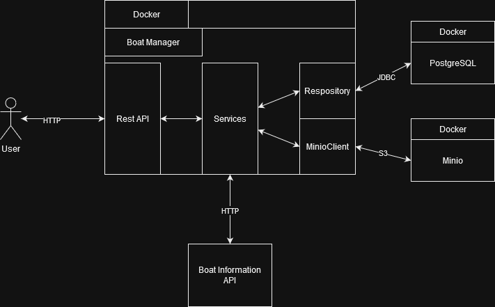

# Boat-manager

This project is a secured Rest API to manage a fleet of Boat.
Once you're logged in, you can:

- Create, Read, Update and Delete boats
- Upload and Download Image for each boat.

## Architecture



The architecture is composed of 3 parts:

- The Boat Manager microservice containerized in Docker. It contains the Rest API so the user can access the Data, it is
  also connected to the database and the object storage.
- The PostgreSQL Database, also containerized in Docker. It will contain all the information about the boats except for
  the image.
- The Minio Object Storage, also containerized in Docker. It will contain all the images of boat.

## Start locally

To start locally, first you need to have Java 17 and the Docker Engine. Then you need to create a local /data directory.

```shell
mkdir data
./gradlew bootRun --args='--spring.profiles.active=dev'
```

This command will create the local /data directory and start the application and 2 containers, one for Postgres and the
other one for Minio

## Deploy in production

When the project is push on main, then a github actions is triggered to start the build of the Docker for Boat
Manager microservice. Then the docker is pushed to Docker Hub and a trigger will launch the restart of the Docker on
the production server.

## Limits and Improvements.

The users are stored in memory and should be moved either in the database or in an Identity management software.

## Sources

Here is the list of website I used to help build this backend (not exhaustive):

- [Spring](https://spring.io/)
- [Baeldung](https://www.baeldung.com)
- [Stackoverflow](https://stackoverflow.com)
- [Minio](https://min.io/)
- [Docker Hub](https://hub.docker.com)
- [Github](https://github.com)